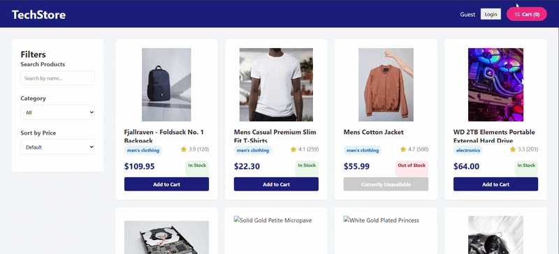
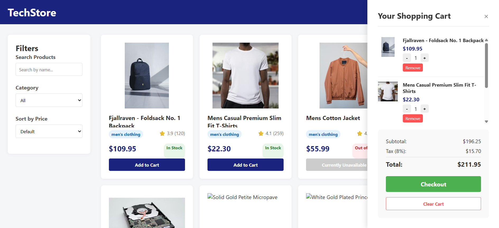

# Task 11: E-Commerce Product Dashboard

### Application Demo



### 1. Main Dashboard


### 2. Active Shopping Cart



[cite_start]This is the final integrated project for the React.js Comprehensive Assignment[cite: 1, 281, 282]. [cite_start]It is a complete working application that demonstrates a deep understanding of React components, props, state management, conditional rendering, list rendering, and event handling[cite: 282, 305, 306, 307, 308].

## 🔗 Live Deployment

**Live Demo:** [https://my-react-assignment-tau.vercel.app/]
[cite_start]_(e.g., https://my-react-assignment-tau.vercel.app/)_ [cite: 334]

---

## ✨ Features Implemented

[cite_start]This application fulfills all core requirements and bonus challenges[cite: 284, 320]:

- [cite_start]**Product Listing:** Displays products fetched from a dummy data array (using Unsplash for reliable images)[cite: 288].
- [cite_start]**Product Details:** Each card shows the image, name, price, rating, category, and real-time stock status[cite: 289].
- [cite_start]**Shopping Cart:** Add items, remove items, and adjust quantities directly from the cart[cite: 290, 327].
- [cite_start]**Dynamic Cart Summary:** Calculates total items, subtotal, and total price including an 8% tax rate[cite: 291, 329].
- [cite_start]**Filtering & Searching:** Filter products by category or search by product name in real-time[cite: 293, 294].
- [cite_start]**Sorting:** Sort products by price (Low to High, High to Low)[cite: 296].
- [cite_start]**Conditional Rendering:** The cart is shown/hidden dynamically, and UI changes based on stock availability and authentication state[cite: 297, 306].
- [cite_start]**Bonus - Empty States:** Friendly empty states for when the cart is empty or a search yields no results[cite: 324].
- [cite_start]**Bonus - Clear Cart:** A single click button to empty the entire cart[cite: 325].
- [cite_start]**Bonus - Responsive Design:** Adapts smoothly to mobile and desktop screens[cite: 322].

---

## 🛠️ Setup Instructions

[cite_start]To run this project locally on your machine[cite: 331]:

1. **Clone the repository** (or navigate to this specific folder):
   ```bash
   cd task-11
   ```
